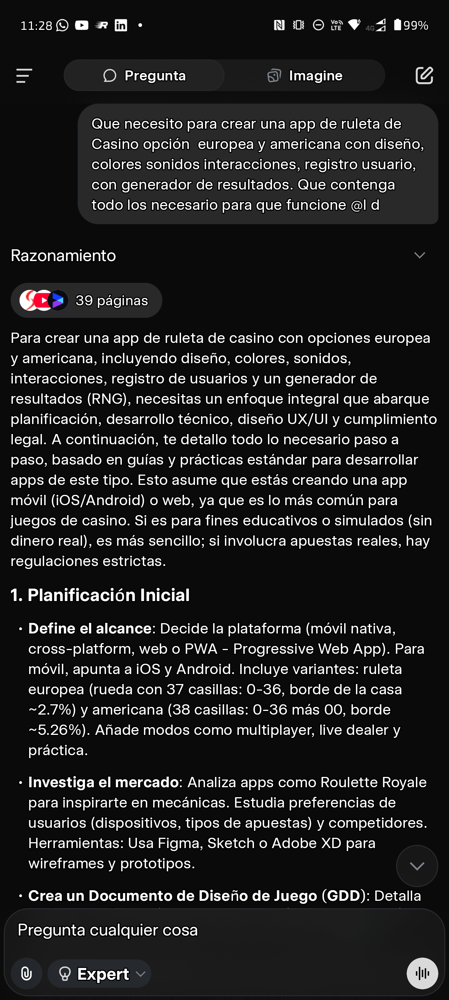
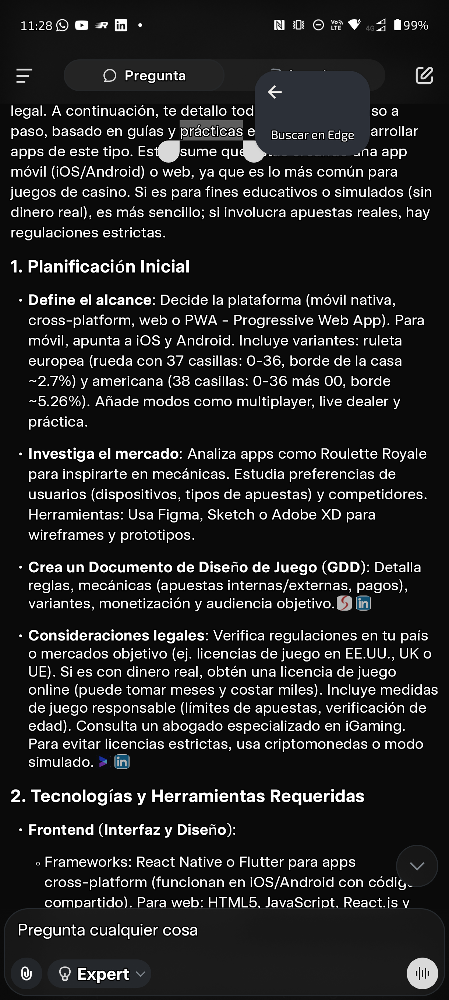
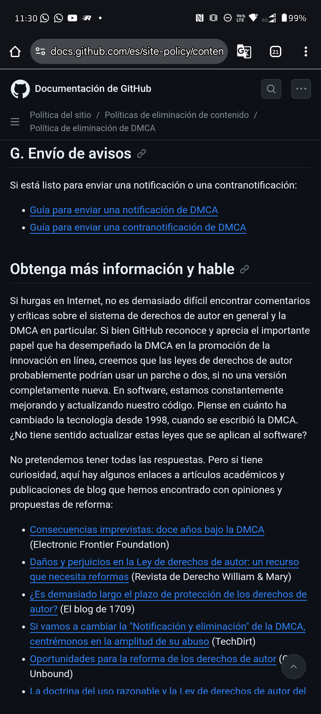

# Tokyo Roulette Predicciones

<p align="center">
  <strong>TokyoApps® - Simulación inteligente para entretenimiento</strong>
</p>

<p align="center">
  
  
  
  
</p>

---

Simulador educativo de ruleta con predicciones, RNG seguro, estrategia Martingale y modelo freemium. Incluye integraciones con Stripe para pagos y Firebase para configuraciones remotas.

## 🎰 Características

- ✨ **RNG Seguro certificado** - Generador de números aleatorios usando `Random.secure()`
- 📊 **Predicciones estadísticas** - Análisis basado en historial de resultados
- 📈 **Estrategia Martingale** - Asesor de apuestas simulado
- 📜 **Historial completo** - Registro de todos los giros
- 🎨 **UI moderna** - Material Design 3 con branding TokyoApps®

## 📱 Screenshots

| Splash | Login | Ruleta | About |
|--------|-------|--------|-------|
|  |  |  |  |

## 🚀 Instalación

### Requisitos previos
- Flutter SDK >= 3.0.0
- Dart SDK >= 3.0.0
- Android Studio / VS Code
- JDK 17+

### Pasos

1. **Clonar el repositorio:**
   ```bash
   git clone https://github.com/Melampe001/Tokyo-Predictor-Roulette-001.git
   cd Tokyo-Predictor-Roulette-001
   ```

2. **Obtener dependencias:**
   ```bash
   flutter pub get
   ```

3. **Ejecutar la aplicación:**
   ```bash
   flutter run
   ```

## 🔨 Construir para Producción

### APK Release
```bash
flutter build apk --release
```
Output: `build/app/outputs/flutter-apk/app-release.apk`

### App Bundle (Play Store)
```bash
flutter build appbundle --release
```
Output: `build/app/outputs/bundle/release/app-release.aab`

## ⚙️ Configuración de Keystore para Android

Para firmar la APK en modo release, necesitas configurar un keystore:

### Opción 1: Archivo key.properties (desarrollo local)
Crea un archivo `key.properties` en el directorio raíz del proyecto con:
```properties
storeFile=/ruta/a/tu/keystore.jks
storePassword=tu_password_del_keystore
keyAlias=tu_alias
keyPassword=tu_password_de_la_key
```

### Opción 2: Variables de entorno (CI/CD)
Define las siguientes variables de entorno en tu sistema de CI:
- `ANDROID_KEYSTORE_PATH`: Ruta al archivo keystore
- `KEYSTORE_PASSWORD`: Contraseña del keystore
- `KEY_ALIAS`: Alias de la key
- `KEY_PASSWORD`: Contraseña de la key

**Nota**: Nunca commits el archivo `key.properties` o el keystore al repositorio.

## 🧪 Testing

### Ejecutar todos los tests
```bash
flutter test
```

### Tests con cobertura
```bash
flutter test --coverage
```

### Análisis estático
```bash
flutter analyze
```

### Verificar formato
```bash
dart format --set-exit-if-changed lib/ test/
```

## 📦 CI/CD Pipeline

El proyecto incluye un workflow completo de GitHub Actions que:

1. **Análisis estático** - `flutter analyze` y verificación de formato
2. **Tests automatizados** - Unit tests y widget tests
3. **Build APK** - Genera APK release optimizada
4. **Build App Bundle** - Genera AAB para Play Store
5. **Validación de branding** - Verifica TokyoApps® en todos los assets
6. **Checklist de compliance** - Genera documentación para publicación

### Artefactos generados
- `tokyo-roulette-apk-release` - APK para distribución directa
- `tokyo-roulette-appbundle` - AAB para Google Play Console
- `compliance-checklist` - Documentación para publicación

## 📋 Estructura del Proyecto

```
tokyo_roulette_predicciones/
├── android/                 # Configuración Android
│   ├── app/
│   │   ├── build.gradle    # Build config con signing
│   │   ├── proguard-rules.pro
│   │   └── src/main/
│   │       ├── AndroidManifest.xml
│   │       ├── kotlin/     # MainActivity
│   │       └── res/        # Resources
│   ├── build.gradle
│   ├── settings.gradle
│   └── gradle.properties
├── lib/
│   ├── main.dart           # App entry point, screens
│   └── roulette_logic.dart # Business logic
├── test/
│   └── widget_test.dart    # Tests completos
├── .github/
│   └── workflows/
│       └── build-apk.yml   # CI/CD pipeline
├── docs/
│   └── checklist_agents.md
├── pubspec.yaml
└── README.md
```

## 🎨 Branding TokyoApps®

- **Nombre**: Tokyo Roulette
- **Marca**: TokyoApps®
- **Slogan**: "Simulación inteligente para entretenimiento"
- **Namespace**: com.tokyoapps.roulette

El branding está presente en:
- ✅ Splash Screen
- ✅ About Screen
- ✅ Android Manifest metadata
- ✅ build.gradle resValues

---

## 📄 Changelog

### v1.0.0 (2024-11-28)
- ✨ Release inicial
- 🎨 Splash Screen con branding TokyoApps®
- 📱 About Screen con disclaimer educativo
- 🧪 Suite completa de tests
- 📦 CI/CD pipeline completo
- 📋 Checklist de compliance para Play Store
- 🔒 ProGuard configurado para release

---

## ⚠️ Disclaimer

**Esta aplicación es estrictamente para entretenimiento y educación sobre probabilidades.**

Tokyo Roulette es una simulación y los resultados son completamente aleatorios. No promueve ni facilita apuestas reales. Los resultados no pueden usarse para predecir resultados en casinos reales.

---

## 📄 Licencia

© 2024 TokyoApps® - Todos los derechos reservados.

Este software es propietario. El uso, copia o distribución sin autorización está prohibido.

---

## Fases del Proyecto

### 1. Definición y planificación
- [x] Redactar objetivo y alcance del proyecto
- [x] Identificar requerimientos y entregables principales
- [x] Crear roadmap con hitos y fechas estimadas
- [x] Asignar responsables a cada tarea

### 2. Diseño técnico y documentación inicial
- [x] Crear documentación técnica básica (arquitectura, flujo, APIs)
- [x] Revisar dependencias y recursos necesarios
- [x] Validar diseño y recibir feedback

### 3. Desarrollo incremental
- [x] Implementar funcionalidades según el roadmap
- [x] Realizar revisiones de código y PR siguiendo checklist
- [x] Actualizar documentación según cambios realizados

### 4. Pruebas
- [x] Ejecutar pruebas unitarias y funcionales
- [x] Validar requisitos y criterios de aceptación
- [x] Corregir errores detectados

### 5. Despliegue y cierre de fase
- [x] Preparar ambiente de release
- [x] Configurar CI/CD completo
- [x] Generar artefactos de release
- [x] Documentar lecciones aprendidas
- [x] Presentar entregables y cerrar fase
